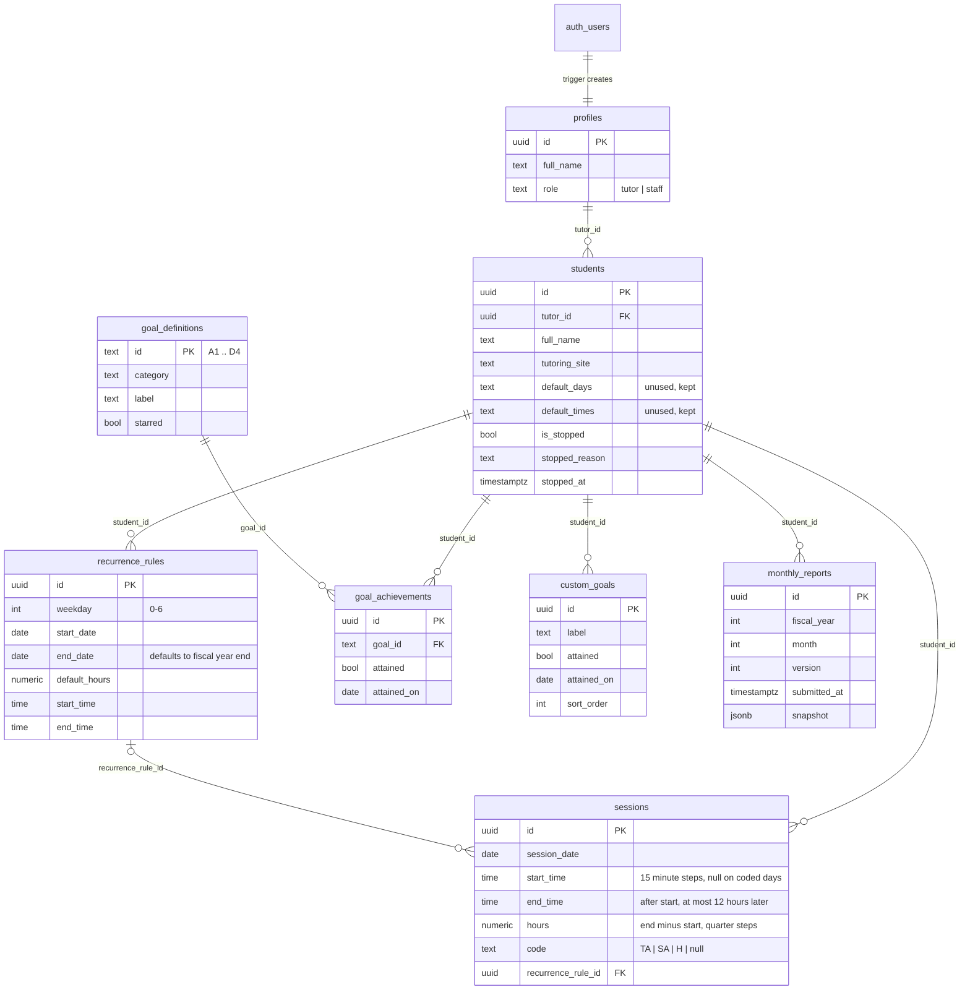

# LVAEP Tutor Reports

A web app for the Literacy Volunteers of America, Essex/Passaic County (LVAEP) tutoring program. Tutors record every tutoring session for their students on a calendar, track goals, and submit a monthly report per student. Staff pick a tutor and a student and see the whole fiscal year assembled into the familiar one page form, print it, download the sessions as CSV, and review every submitted version.

It replaces the paper form (one sheet per student with a 31 by 12 attendance grid, a STOPPED checkbox and an achievements checklist) with:

- one tutor account that holds all of that tutor's students,
- a month calendar with weekly repeating sessions and color coded absence and holiday codes,
- "No longer tutoring" as an action with a required reason,
- collapsible goal categories instead of one long list,
- staff views built from versioned monthly submissions, with a live view for progress before month end.

## Run it locally in ten minutes

### 1. Prerequisites

- Node.js 20 or newer (developed on 26) and npm
- A Supabase project (free tier is fine)
- The Supabase CLI (`npm i -g supabase` or `brew install supabase/tap/supabase`)

### 2. Configure environment variables

```bash
cp .env.example .env.local
```

Fill in `NEXT_PUBLIC_SUPABASE_URL` and `NEXT_PUBLIC_SUPABASE_ANON_KEY` from your project's Settings, API page. `SUPABASE_SERVICE_ROLE_KEY` is optional: the app never uses it; only the Playwright end to end test does, to delete the accounts it creates. `.env.local` is git ignored.

### 3. Apply the migrations and the seed

```bash
npm install
supabase login
supabase link --project-ref <your-project-ref>
supabase db push --include-seed
```

`supabase db push` applies everything in `supabase/migrations` (tables, constraints, functions, the profile trigger, RLS policies and the goal list). `--include-seed` runs `supabase/seed.sql`, which creates the demo accounts and data below. The seed is safe to run again: re-run it with `supabase db query --linked -f supabase/seed.sql`.

You can also paste the migration files, in order, and then `seed.sql` into the SQL editor in the Supabase dashboard.

### 4. Turn off email confirmation

The demo uses email and password only, with no confirmation email, so new sign ups can use the app right away. Either:

- run `supabase config push` (the checked in `supabase/config.toml` declares only `enable_confirmations = false`, the site URL and the redirect URL, so nothing else on the project changes), or
- in the dashboard go to Authentication, Providers, Email and turn off "Confirm email".

### 5. Start the app

```bash
npm run dev
```

Open http://localhost:3000 and sign in with a demo account.

### Demo accounts

All demo accounts use the password `Demo1234!`.

| Email | Role | What you will see |
| --- | --- | --- |
| `tutor1@lvaep.demo` | Tutor (Maria Alvarez) | Three students (one stopped), weekly sessions, goals, submitted reports for last month |
| `tutor2@lvaep.demo` | Tutor (James Okafor) | Two students, one with a missing report last month |
| `staff@lvaep.demo` | Staff (Dana Rivera) | Both tutors, all students, missing reports list, full records |

The seed uses dates relative to today, so the current fiscal year always has data. Two students have a report submitted for last month; one does not, so the staff "missing reports" card has something to show.

### Scripts

| Command | What it does |
| --- | --- |
| `npm run dev` | Development server |
| `npm run build` and `npm start` | Production build and server |
| `npm run lint` | ESLint (Next.js core web vitals and TypeScript rules) |
| `npm run typecheck` | `tsc --noEmit` with strict mode |
| `npm run test` | Vitest unit tests |
| `npm run test:e2e` | Playwright end to end pass over every user facing flow, plus a check that one tutor cannot read another's students through the API (needs `npx playwright install chromium` once, a running app or it starts `npm run dev`, and a real Supabase project; it creates and removes its own accounts) |

Set `PLAYWRIGHT_BASE_URL` if the app runs on a port other than 3000.

### Deploy to Vercel

Import the repository, add the two `NEXT_PUBLIC_SUPABASE_*` environment variables, and deploy. Nothing else is required. Add the Vercel URL to the Supabase project's redirect URLs if you later enable email confirmation.

## How it works

### Tutors

- **Home** (`/home`): total hours card (this month, this fiscal year, all time), active students with hours this month and fiscal year, goals attained and the next session, a greyed out "No longer tutored" section with reasons and a Reactivate action. Add a student (name and site), open a student to edit, submit a report and end tutoring ("No longer tutoring") from each row.
- **Student detail** (`/students/[id]`): header fields save inline as you type. Two tabs, both auto saving with a small Saved indicator and a revert plus toast on failure.
  - **Tutoring days**: a month calendar scoped to the fiscal year (July to June) with a fiscal year selector for past years. Click an empty day to enter a start and end time in 15 minute steps; the hours are the difference, shown live, and a session can optionally repeat weekly to the end of the fiscal year with the same times. Click a session to change its times, set a code (Tutor absent, Student absent, Holiday) or delete it; sessions that belong to a weekly schedule ask "This day only" or "This and future days". Hours show in blue, TA in orange, SA in yellow, H in gray; today is outlined. Arrow keys move between days and the editor becomes a bottom sheet on phones.
  - **Goals**: one collapsible section per category with "n of m attained", a checkbox and a date per goal. E. Other(s) is the tutor's own list: Add goal opens a new row with a description, an Attained box with a date once checked, and Remove (which asks first when the goal is attained). Empty rows are never saved. Wording and asterisks are copied from the form.
- **Hours** (`/hours`): a bar chart of hours per month, a table of hours per student per month and a running total, with a fiscal year selector.
- **Submit report**: pick a month (each shows "Submitted (vN)" or "Not submitted" and how many days it has), validation lists exactly what is missing with a link to fix it, then a confirmation step. Each submission stores a JSON snapshot with a new version number. Live data stays editable.

### Staff

- **Staff home** (`/staff`): submitted reports this month, a "missing reports" list for last month (active students who had sessions but no submission), a searchable tutor list with active student counts, and the selected tutor's students (stopped ones greyed). On narrow screens this becomes a drill down.
- **Student record** (`/staff/students/[id]`): the full year form laid out like the paper original. Each month of the 31 by 12 grid comes from that month's latest submitted snapshot; months without a submission show a "Not submitted" mark in the column header. Column totals, a grand total, STOPPED status and reason, every goal with check marks and attained dates, the tutor's own goals one per line under E. Other(s), the contact block and the footer note. Actions: Print / Save as PDF (one letter page, portrait, no navigation), Download CSV of the year's sessions, a submission history panel where any older version can be viewed, and a Live view toggle that shows current unsubmitted data, clearly labeled.

## Architecture

### Folder layout

```
src/
  app/
    (auth)/            login and signup pages plus their server actions
    (app)/             signed in pages, wrapped by the nav shell
      home/            tutor home
      students/[id]/   student detail (calendar and goals tabs)
      hours/           hours chart and table
      staff/           staff home
      staff/students/[id]/            staff record page
      staff/students/[id]/sessions.csv/  CSV route handler
  proxy.ts             Next.js 16 request middleware: refreshes the Supabase session, redirects by role
  components/
    ui/                shadcn/ui primitives (Base UI based)
    layout/            app shell, nav, breadcrumbs, page header
    students/, student-detail/, calendar/, goals/, reports/, hours/, staff/
  lib/
    supabase/          server client, browser client, middleware helper, hand written Database types
    actions/           server actions (zod validated): students, sessions, goals, reports
    data/              server only queries used by pages
    fiscal-year.ts     fiscal year helpers (mirrors the SQL function)
    recurrence.ts      weekly recurrence planning
    hours.ts           hour totals, code handling
    reports.ts         report validation, snapshot building, snapshot parsing
    record.ts          assembling the staff year grid and CSV from snapshots or live sessions
supabase/
  migrations/          schema, RLS, goal definitions, staff read only fix, session functions, session times, custom goals
  seed.sql             demo accounts and data
  config.toml          minimal CLI config (auth settings only)
tests/
  unit/                Vitest
  e2e/                 Playwright end to end pass
```

All reads and writes go through server components, server actions and one route handler using the server Supabase client, so Row Level Security applies to every query. The browser client exists for auth only.

### Data model



Key constraints: `sessions` is unique per `(student_id, session_date)`, `hours` must be between 0 and 12 in 0.25 steps, and `code is null or hours = 0` so a coded day always has 0 hours. `start_time` and `end_time` are set together, on 15 minute steps, with the end after the start; `hours` is always written as end minus start so every total, report and snapshot reads it unchanged. `students.default_days` and `students.default_times` remain in the table but nothing reads them: the form's Day(s) are the weekdays of the student's active weekly schedules and Time(s) the start and end most of the fiscal year's sessions share. `monthly_reports` is unique per `(student_id, fiscal_year, month, version)`. `fiscal_year_of(date)` in SQL and `fiscalYearOf()` in TypeScript agree: July to December belong to that year's fiscal year, January to June to the previous year's.

### Row Level Security

- `is_staff()` and `is_tutor()` are security definer helpers that read `profiles.role` for the signed in user.
- Tutors can select, insert, update and delete rows where `tutor_id = auth.uid()` in `students`, `recurrence_rules`, `sessions`, `goal_achievements`, `custom_goals` and `monthly_reports`. Child rows also require `owns_student(student_id)`, so a tutor cannot attach data to another tutor's student.
- Staff can select every row in those tables and cannot write any of them. Write policies require the tutor role, so a staff account cannot create rows under its own id either.
- `profiles`: users read their own row, staff read all, users can update their own name but not their role. Profile rows are created only by the trigger on `auth.users`.
- `goal_definitions` is readable by anyone signed in.
- Reports cannot be updated or deleted by anyone: each submission is a new version.

The calendar's weekly materialization and "this and future days" edits run inside Postgres functions marked security invoker, so they are transactional and still subject to RLS.

## Assumptions and decisions

- The original form is submitted monthly per student; the year grid exists so the same sheet accumulates. The app mirrors that: tutors submit per student per month and staff see the assembled year.
- The fiscal year runs July 1 through June 30 and is named after the calendar year it starts in (2026-2027 is fiscal year 2026). Nothing is hardcoded to a particular year.
- Only hours tutored matter. There is no notion of lateness or partial credit beyond hours.
- TA, SA and H days always count as 0 hours, enforced by a check constraint and in every total.
- Goal wording, asterisks, contact information and the footer note are program provided and copied verbatim.
- Submitting a report does not lock data. Each submission is a versioned snapshot; the live data stays editable and resubmitting creates a new version.
- Students no longer tutored remain visible, greyed, with their reason and date, and can be reactivated. History is never deleted. Staff see the change in their view, so the tutor is not asked to notify the office. The word "Stopped" appears only on the staff record, where it mirrors the paper form.
- Staff are read only over tutor data.
- No email confirmation and no OAuth, to keep the demo frictionless.
- A weekly schedule writes a session for every matching weekday through the end of the fiscal year, using the default hours. Hour totals on the home card, the hours page and the calendar strip therefore count only sessions dated today or earlier, and the calendar shows the rest as "more planned". A report snapshot includes every session in the month, so the intended flow is to submit after the month ends (or delete days that did not happen first).
- Report validation requires the student name, tutoring site, the tutor's name and at least one day with hours or a code in the month; a stopped student also needs a reason. Goals are never required.
- The "missing reports" list means active students who had at least one session last month but no submission for that month. Students with no sessions at all are not chased.
- Sessions can be entered for any day, past or future.
- One session per student per day. Two meetings on the same day are entered as one session spanning both.
- A session is a start and an end time in 15 minute steps; hours are the difference, rounded to the nearest quarter, and a session cannot end at or before it starts or run longer than 12 hours. Coded days have no times. Hours are stored with two decimals and validated to quarter hour steps in the UI and in the database.
- Nobody types "usual days" or "usual times" any more. The report's Day(s) box lists the weekdays of the student's active weekly schedules and Time(s) the most common start and end across the fiscal year's sessions; both are blank when there is no data, and each report snapshot keeps the values as they were at submission along with every session's start and end.
- Deleting "this and future days" ends the weekly rule the day before; deleting the last remaining day of a rule one at a time removes the empty rule.
- "Today" is computed on the server in the server's time zone (UTC on Vercel). Around midnight the tutor's local date and the server's date can differ by a few hours; this only affects which day is outlined and which sessions count as "so far".
- Next.js 16 renamed middleware to `proxy.ts`. It does the same job: refresh the Supabase session cookie and redirect signed out users to `/login`, tutors away from `/staff`, and staff away from tutor pages. Pages and server actions check the role again, so access never depends on the proxy alone.
- The staff record header, STOPPED status and achievements come from the most recent submitted snapshot of the selected fiscal year (or live data in Live view), while each grid column comes from that month's latest version. Viewing an older version pins that version for its month only.
- shadcn/ui components are generated on top of Base UI (the current shadcn default). Simple form controls use native inputs, selects and checkboxes for accessibility and predictable behavior.
- Database types are hand written in `src/lib/supabase/database.types.ts` to avoid a code generation step; they must be updated alongside migrations.

## What I would do next

- Notify the office automatically (email) when a tutor ends tutoring a student, and remind tutors about unsubmitted months near month end.
- Let staff export a whole month for every student as one CSV or PDF bundle, and add program level totals (hours per site, per month).
- Add a "did this session happen?" nudge for planned days once the date passes, instead of relying on tutors to delete days that did not happen.
- Allow a session's notes to be edited in the calendar (the column exists) and show them on the staff record.
- Generate the Supabase types from the schema in CI and add a check that the migrations and the hand written types agree.
- Add role management for staff (invite tutors, reassign a student to another tutor, archive accounts) with matching RLS.
- Add per tutor time zone support so "today" follows the tutor rather than the server.
- Broaden the tests: component tests for the calendar editor and report dialog, and an RLS test suite that runs the policies against a local Supabase instance.
